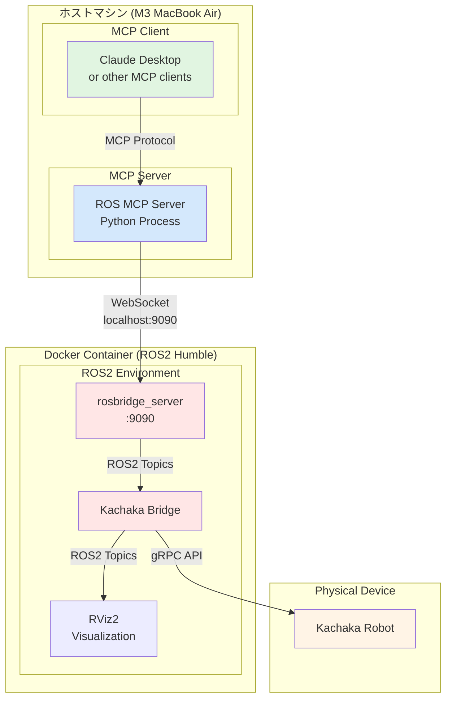

# ROS MCP Server for Kachaka Robot Control


[](https://smithery.ai/server/@lpigeon/ros-mcp-server)


## 概要

このプロジェクトは、[Preferred Robotics](https://www.pfrobotics.jp/)が開発する自律移動ロボット「kachaka（カチャカ）」を、Claude DesktopなどのMCP対応クライアントから自然言語で制御するためのセットアップガイドです。

kachakaは、LiDARやカメラを使った自律移動機能を持ち、専用家具と連携して家具ごと移動させることができる革新的なロボットです。本セットアップにより、「テーブルを持ってきて」「キッチンに移動して」といった自然な言葉でロボットを操作できるようになります。

## システム構成



## 前提条件

- **ハードウェア**: Apple Silicon Mac (M1/M2/M3)
- **MCP対応クライアント** (Claude Desktop等) がインストール済み
- **Python 3.10以上** がインストール済み
- **kachakaロボット** がネットワークに接続済み

## セットアップ手順

### 1. リポジトリのクローンとuv のインストール

```bash
# リポジトリをクローン
git clone https://github.com/lpigeon/ros-mcp-server.git
cd ros-mcp-server

# uvをインストール (まだインストールしていない場合)
curl -LsSf https://astral.sh/uv/install.sh | sh
# または
pip install uv

# 仮想環境の作成と有効化 (オプション)
uv venv
source .venv/bin/activate
```

### 2. IPアドレスとポートの設定

`server.py` を開き、以下の設定を確認します（通常はデフォルト値のままで動作します）：

```python
LOCAL_IP = "127.0.0.1"      # ローカルループバックアドレス
ROSBRIDGE_IP = "127.0.0.1"  # Dockerポート転送を使用
ROSBRIDGE_PORT = 9090       # デフォルトポート
```

### 3. ROS2 HumbleのDockerコンテナを起動

```bash
docker run \
  --security-opt seccomp=unconfined \
  -v ~/ros2_ws:/home/ubuntu/colcon_ws:cached \
  -v /var/run/docker.sock:/var/run/docker.sock \
  -p 6080:80 \
  -p 10000:10000 \
  -p 9090:9090 \
  --shm-size=1024m \
  tiryoh/ros2-desktop-vnc:humble-arm64
```

ブラウザで http://localhost:6080 にアクセスして、VNC経由でコンテナ内のデスクトップを確認できます。

### 4. MCP Serverの設定

MCPクライアントの設定ファイル（Claude Desktopの場合）を編集します：

**macOS:**
```bash
code ~/Library/Application\ Support/Claude/claude_desktop_config.json
```

以下の内容を追加：
```json
{
  "mcpServers": {
    "ros-mcp-server": {
      "command": "uv",
      "args": [
        "--directory",
        "/absolute/path/to/ros-mcp-server",
        "run",
        "server.py"
      ]
    }
  }
}
```

**注意**: `/absolute/path/to/ros-mcp-server` は実際のパスに置き換えてください。

### 5. Dockerコンテナ内でrosbridge_serverをインストール・起動

Dockerコンテナ内のターミナルで実行：

```bash
# rosbridge_serverをインストール
sudo apt update
sudo apt install -y ros-humble-rosbridge-server

# rosbridgeを起動（ポート9090を使用）
source /opt/ros/humble/setup.bash
ros2 launch rosbridge_server rosbridge_websocket_launch.xml
```

### 6. Kachakaブリッジの起動

別のターミナルで、Dockerコンテナ内で実行：

```bash
# Kachaka APIリポジトリをクローン
cd ~
git clone https://github.com/pf-robotics/kachaka-api.git
cd kachaka-api

# Dockerイメージをビルド（初回のみ）
docker buildx build -t kachaka-api --target kachaka-grpc-ros2-bridge -f Dockerfile.ros2 . --build-arg BASE_ARCH=arm64 --load

# ブリッジを起動（<kachakaのIPアドレス>を実際のIPに置き換える）
cd tools/ros2_bridge
./start_bridge.sh <kachakaのIPアドレス>
```

### 7. 動作確認 - RViz2による可視化（オプション）

Dockerコンテナ内の別ターミナルで実行：

```bash
# ワークスペースの準備
mkdir -p ~/ros2_ws/src
cd ~/ros2_ws/src
ln -s ~/kachaka-api/ros2/kachaka_interfaces/ kachaka_interfaces
ln -s ~/kachaka-api/ros2/kachaka_description/ kachaka_description

# ビルド
cd ~/ros2_ws
source /opt/ros/humble/setup.bash
colcon build
source install/setup.bash

# RViz2を起動
cd src/kachaka_description/config
rviz2 -d kachaka.rviz
```

## 使用方法

1. すべてのサービスが起動していることを確認
2. Claude Desktopなどのクライアントを開く
3. 自然言語でコマンドを入力：
   - 「ロボットを前進させて」
   - 「利用可能なトピックを表示して」
   - 「カメラ画像を取得して」
   - 「30cm前進してから右に90度回転して」

## 利用可能なMCP関数

- **get_topics**: ROSトピックの一覧を取得
- **pub_twist**: 移動コマンドを送信（線速度・角速度）
- **pub_twist_seq**: 一連の移動コマンドを順次実行
- **sub_front_image**: フロントカメラ画像を取得・保存
- **sub_back_image**: バックカメラ画像を取得・保存

## 関連リンク

- [Preferred Robotics (kachaka)](https://www.pfrobotics.jp/)
- [kachaka API](https://github.com/pf-robotics/kachaka-api)
- [ROS MCP Server (Original)](https://github.com/lpigeon/ros-mcp-server)
